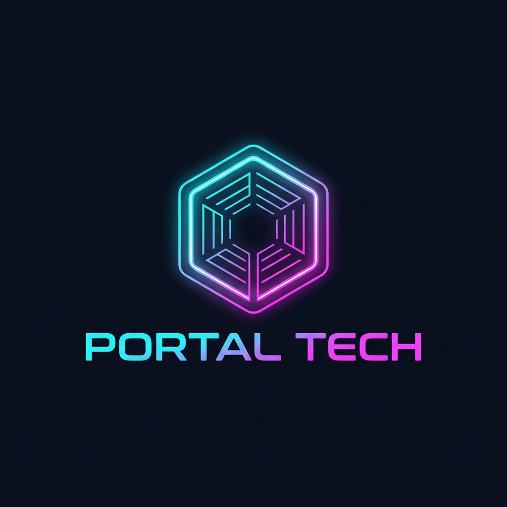

<p align="center">
  
</p>

Secure tunneling tool for local development, built with Rust.

## Why PortalTech?

Exposing local development servers to the internet is a common necessity for testing webhooks, mobile apps, or sharing work-in-progress. However, many existing solutions are either closed-source, have restrictive paid tiers, or lack the performance and security required for modern workflows.

**PortalTech** was created to fill this gap by providing:
- **Zero-Trust by Default**: Integrated token-based authentication and header sanitization.
- **Extreme Performance**: Built on Rust's asynchronous `tokio` stack for near-zero latency.
- **Transparent Traffic**: A built-in terminal UI to inspect every request and response in real-time.
- **Open and Extensible**: A lightweight codebase that can be self-hosted or included in CI/CD pipelines.

## Features
- 🚀 **High Performance**: Built with Rust and Tokio for minimal overhead.
- 🔒 **Secure**: Header sanitization, body size limits, and token-based authentication.
- 🛠️ **Developer Friendly**: Real-time traffic inspection UI.

## Installation via NPM

You can now use PortalTech without manual compilation:

```bash
# Global installation
npm install -g portal-tech

# Or use without installation
npx portal-tech --port 8000
```

## Local Development

### Requirements
- Rust (latest stable)
- Node.js (for NPM packaging testing)

### Building from Source

```bash
# Build the entire workspace
cargo build --release

# Run the relay server
cargo run -p server

# Run the CLI client manually
cargo run -p cli -- --port 8000
```

## Security & Production

### Environment Variables
For production deployments, never rely on default tokens. Use the `PORTAL_AUTH_TOKEN` environment variable on both the server and the CLI:

```bash
# Server
export PORTAL_AUTH_TOKEN="your-secure-random-token"
./portal-tech-server

# CLI (via env)
export PORTAL_AUTH_TOKEN="your-secure-random-token"
portaltech --port 8000
```

### HTTPS / SSL
The Relay Server is designed to run behind a reverse proxy (like Nginx, Caddy, or a Cloud Load Balancer) in production. This handles SSL termination and ensures all traffic is encrypted via HTTPS/WSS.

**Example Caddyfile:**
```text
portal.yourdomain.com {
    reverse_proxy localhost:3000
}
```

## License

This project is licensed under the MIT License - see the [LICENSE](LICENSE) file for details.

---

<p align="center">
  © 2026 Jose Alvarez Dev • Built with 🦀 in Rust
</p>


